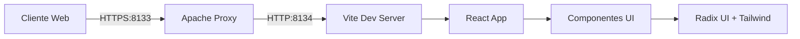

# 🏥 Fresnel Report

<div align="center">


**Sistema Profissional de Geração de Laudos Ultrassonográficos**

[Demo](https://ultrassom.ai:8133) • [Documentação](./CLAUDE.md) • [Reportar Bug](https://github.com/Anderson-Barcellos/Turing/issues)

</div>

## 📋 Sobre o Projeto

O **UltraSound Report GE** é um sistema especializado para geração de laudos médicos de ultrassonografia, focado em **Ultrassom de Abdome Total**. Desenvolvido para profissionais de saúde brasileiros, oferece uma interface intuitiva e eficiente para documentação de exames ultrassonográficos.

### ✨ Principais Funcionalidades

- 🔍 **Navegação por Órgãos** - Interface organizada por sistemas e órgãos abdominais
- 📝 **Seleção de Achados Patológicos** - Biblioteca completa de achados comuns categorizados
- 🤖 **Impressão Sugerida com IA** - Integração direta com Gemini 2.5 Pro para antecipar a impressão diagnóstica
- 📄 **Geração Automática de Laudos** - Compilação inteligente em formato profissional
- 🎨 **Interface Moderna** - Design limpo e responsivo com Tailwind CSS
- ⚡ **Performance Otimizada** - Build rápido com Vite e hot-reload instantâneo
- 🔒 **Segurança** - HTTPS com certificados Let's Encrypt válidos

## 🚀 Início Rápido

### Pré-requisitos

- Node.js 20.16+
- npm 9.2+
- Git

### Instalação

1. **Clone o repositório**
```bash
git clone https://github.com/Anderson-Barcellos/Turing.git
cd Turing
```

2. **Instale as dependências**
```bash
npm install
```

3. **Inicie o servidor de desenvolvimento**
```bash
npm run dev
```

4. **Acesse a aplicação**
```
http://localhost:8134
```

## 🛠️ Scripts Disponíveis

| Comando | Descrição |
|---------|-----------|
| `npm run dev` | Inicia servidor de desenvolvimento na porta 8134 |
| `npm run build` | Cria build de produção otimizada |
| `npm run preview` | Visualiza build de produção localmente |
| `npm run lint` | Executa linter no código |
| `npm run kill` | Para o servidor na porta 8133 |

## 🏗️ Arquitetura



### Stack Tecnológica

- **Frontend Framework:** React 19 com TypeScript
- **Build Tool:** Vite 6.3
- **Estilização:** Tailwind CSS v4 + Radix UI
- **Servidor Web:** Apache 2.4 (Reverse Proxy)
- **SSL/TLS:** Let's Encrypt
- **Ícones:** Phosphor Icons + Lucide React

## 📁 Estrutura do Projeto

```
Turing/
├── src/
│   ├── components/        # Componentes React reutilizáveis
│   │   ├── ui/           # Componentes base (Button, Card, etc)
│   │   ├── Sidebar.tsx   # Navegação lateral
│   │   ├── OrganSection.tsx # Seção de órgãos
│   │   └── ReportCanvas.tsx # Área de visualização do laudo
│   ├── data/             # Dados estruturados
│   │   └── organs.ts     # Banco de dados de órgãos e achados
│   ├── services/         # Lógica de negócio
│   │   ├── reportGenerator.ts # Geração de laudos
│   │   └── geminiClient.ts    # Cliente para o Gemini 2.5 Pro
│   ├── styles/           # Arquivos de estilo
│   ├── types/            # TypeScript definitions
│   └── App.tsx           # Componente principal
├── vite.config.ts        # Configuração do Vite
├── tailwind.config.js    # Configuração do Tailwind
├── package.json          # Dependências e scripts
├── CLAUDE.md            # Documentação técnica detalhada
└── README.md            # Este arquivo
```

## 🔧 Configuração de Produção

### Deployment com HTTPS

O projeto está configurado para rodar em produção com HTTPS usando Apache como reverse proxy:

## 🔌 Integração com Google Gemini 2.5 Pro

1. Gere uma chave de API no [Google AI Studio](https://aistudio.google.com/).
2. Crie um arquivo `.env` na raiz do projeto (ou ajuste o existente) com o conteúdo:

```bash
VITE_GEMINI_API_KEY=coloque_sua_chave_aqui
```

3. Reinicie o servidor (`npm run dev`).

Com a chave configurada, a interface solicitará automaticamente ao **Gemini 2.5 Pro** uma impressão diagnóstica sempre que novos achados forem registrados nas seções clínicas.

1. **Apache (Porta 8133)** - Gerencia SSL/TLS e segurança
2. **Vite (Porta 8134)** - Serve a aplicação React

Consulte [CLAUDE.md](./CLAUDE.md) para configuração detalhada do ambiente de produção.

### Variáveis de Ambiente

Crie um arquivo `.env` na raiz do projeto:

```env
VITE_API_URL=https://api.ultrassom.ai
GEMINI_API_KEY=sua_chave_aqui
```

> A chave `GEMINI_API_KEY` deve ser configurada apenas no ambiente de servidor. O frontend consome o modelo Gemini via o proxy interno exposto em `/api/gemini-impression`, garantindo que o segredo não seja exposto no bundle do cliente.

## 🤝 Contribuindo

Contribuições são bem-vindas! Por favor, siga estes passos:

1. Fork o projeto
2. Crie uma branch para sua feature (`git checkout -b feature/NovaFuncionalidade`)
3. Commit suas mudanças (`git commit -m 'Add: Nova funcionalidade'`)
4. Push para a branch (`git push origin feature/NovaFuncionalidade`)
5. Abra um Pull Request

### Convenções de Código

- Use TypeScript para todo código novo
- Siga as convenções do ESLint configurado
- Mantenha componentes pequenos e focados
- Adicione tipos TypeScript apropriados
- Documente funções complexas

### Branch Principal

Este projeto usa **`main`** como branch principal. Certifique-se de que qualquer integração externa ou ferramenta de CI/CD esteja configurada para usar `main` ao invés de `master`.

## 📊 Status do Projeto

- ✅ Interface base implementada
- ✅ Navegação por órgãos funcional
- ✅ Sistema de seleção de achados
- ✅ Geração básica de laudos
- ✅ Deploy com HTTPS configurado
- 🔄 Integração com IA (em desenvolvimento)
- 📅 Sistema de templates personalizados (planejado)
- 📅 Exportação em múltiplos formatos (planejado)

## 🔐 Segurança

- HTTPS habilitado com Let's Encrypt
- Headers de segurança configurados
- Proxy reverso isolando aplicação
- Validação de entrada de dados
- Sem armazenamento de dados sensíveis no cliente

## 📝 Licença

Este projeto está licenciado sob a Licença MIT - veja o arquivo [LICENSE](LICENSE) para detalhes.

## 👥 Autores

- **Anderson Barcellos** - *Desenvolvimento Inicial* - [@Anderson-Barcellos](https://github.com/Anderson-Barcellos)

## 🙏 Agradecimentos

- Equipe médica consultora pelo feedback valioso
- Comunidade React e Vite pela excelente documentação
- Radix UI pela biblioteca de componentes acessíveis

## 📞 Suporte

Para suporte, envie um email para suporte@ultrassom.ai ou abra uma issue no [GitHub](https://github.com/Anderson-Barcellos/Turing/issues).

---

<div align="center">

Desenvolvido com ❤️ para a comunidade médica brasileira

**[ultrassom.ai](https://ultrassom.ai:8133)**

</div>
